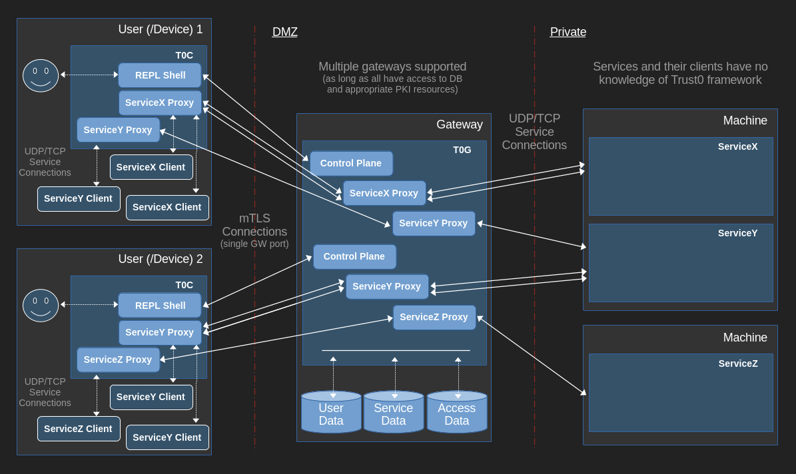

<!-- TOC -->
  * [Trust0 SDP Service Access Framework](#trust0-sdp-service-access-framework)
    * [Summary](#summary)
    * [To-Do](#to-do)
    * [Experimental](#experimental)
    * [Change History](#change-history)
    * [Contributions](#contributions)
    * [License](#license)
  * [Architecture](#architecture)
    * [Overview](#overview)
    * [Network Diagram](#network-diagram)
    * [Control Plane](#control-plane)
    * [Service Proxy](#service-proxy)
    * [Client Auth](#client-auth)
    * [Database](#database)
      * [User Table](#user-table)
      * [Service Table](#service-table)
      * [Access Table](#access-table)
  * [Invocation](#invocation)
    * [Trust0 Gateway](#trust0-gateway)
    * [Trust0 Client](#trust0-client)
    * [Tools](#tools)
      * [Create Root CA PKI Resources](#create-root-ca-pki-resources)
      * [Create Gateway PKI Resources](#create-gateway-pki-resources)
      * [Create Client PKI Resources](#create-client-pki-resources)
  * [Examples](#examples)
    * [Example - Chat TCP service](#example---chat-tcp-service)
    * [Example - Echo UDP service](#example---echo-udp-service)
<!-- TOC -->

## Trust0 SDP Service Access Framework

-----------------

### Summary

Trust0 is a [Zero Trust](https://en.wikipedia.org/wiki/Zero_trust_security_model) security framework, whose implementation is fashioned as a [Software Defined Perimeter](https://en.wikipedia.org/wiki/Software-defined_perimeter) service gateway. The gateway ensures that users may only access services, which were authorized for their account.

This is very early alpha, use with care.

### To-Do

* Verify/add macOS and Windows support
* Enhance gateway for runtime client certificate reissuance (on expiry or on demand)
* Finalize certificate revocation list (CRL) support
* Incorporate device posture trust assessment and rules processor for security enforcement
* Build (more) testing: unit, integration, performance, ...
* Strategize non-name resolution (DNS/hosts file/...) approach to handle client TLS hostname verification for service connections
* Supply more comprehensive source commenting
* Develop tool: Trust0 client installer (dotfiles/... location for binary and supporting files)
* Consider supporting UDP multicast services
* Consider gateway-to-gateway service proxy routing (reasons of proximity, security, ...)
* Consider gateway load-balancing, via client redirect (reasons of load, rollout deployment, ...)
* Incorporate runtime certificate revocation list (CRL) reload on updated list
* Accommodate integration to well-known identity provider (IdP) systems/protocols for user authentication and 2FA purposes

### Experimental

* Certificate revocation list (CRL) file support. Handle runtime updates for updated lists
 
### Change History

Refer to [Change Log](CHANGES.md)

### Contributions

We welcome and appreciate questions, bug issues, ideas and the like. However code contributions are currently closed until after the first non-alpha release.

### License

Copyright 2023 the Trust0 Authors. All rights reserved.

Licensed under the Apache License, Version 2.0 (the "License"); you may not use
these files except in compliance with the License. You may obtain a copy of the
License at

    http://www.apache.org/licenses/LICENSE-2.0

Unless required by applicable law or agreed to in writing, software distributed
under the License is distributed on an "AS IS" BASIS, WITHOUT WARRANTIES OR
CONDITIONS OF ANY KIND, either express or implied. See the License for the
specific language governing permissions and limitations under the License.

## Architecture

-----------------

### Overview

In a nutshell, a user will start up the Trust0 Client (T0C) application, which connects to a Trust0 Gateway (T0G) server for the sole purpose of opening up further proxies to authorized services. Then respective service proxy listeners on the user's T0C will be ready to accept new connections.

Likewise, there are 2 types of T0C -> T0G connections:
* Control Plane
* Service Proxy

Both connection types require mTLS, which allows both parties to authenticate each other. The T0C will use a certificate, which has embedded (device/)user information. This is used by the T0G to validate their account and determine their authorized services. The T0G has access to 3 DBs: users, services, and service authorization.

There is no authentication enforced for network connections made to the T0C. Likewise, this client is not secure to run on a multi-user machine and should be only be used on a single-user/personal computer (or some other scenario that can restrict access).

### Network Diagram



### Control Plane

The Control Plane connection is required and the first connection made between the T0C and a T0G. A REPL shell will be opened and the user may enter various commands:

| Command     | Description                                                         |
|-------------|---------------------------------------------------------------------|
| about       | Display context information for connected mTLS device user          |
| connections | List current service proxy connections                              |
| ping        | Simple gateway heartbeat request                                    |
| proxies     | List active service proxies, ready for new connections              |
| services    | List authorized services for connected mTLS device user             |
| start       | Startup proxy to authorized service via secure client-gateway proxy |
| stop        | Shutdown active service proxy (previously started)                  |
| quit        | Quit the control plane (and corresponding service connections)      |
| help        | Print this message or the help of the given subcommand(s)           |

In the REPL shell, issue `help <COMMAND>` to learn more about these commands.

### Service Proxy

Of note, `start` is a key command which is used to open up new service proxies.

```
Trust0 SDP Platform v0.1.0-alpha (enter 'help' for commands)
> start -s chat -p 8501
{
  "code": 200,
  "message": null,
  "request": {
    "Start": {
      "service_name": "chat",
      "local_port": 8501
    }
  },
  "data": {
    "client_port": 8501,
    "gateway_host": "localhost",
    "gateway_port": 8400,
    "service": {
      "host": "localhost",
      "id": 203,
      "name": "chat",
      "port": 8500,
      "transport": "TCP"
    }
  }
}
> 
```

Once started, the specified local port (`8501` in the example above) will listen for new connections for the specified service. Subsequently, when a connection is made from a service client application to this local port, then a Service Proxy mTLS connection (the aforementioned second type of "T0C <--> T0G" connection) is created for the bidirectional copying of data. This connection will create a further proxy connection from T0G <--> Service, to similarly (bidrectionally) copy data.

To recap, 3 total connections make up the virtual connection to a service:

&nbsp;&nbsp;&nbsp;&nbsp;<u>Service Client</u> ` <--TCP|UDP--> ` <u>T0C</u> ` <--mTLS--> ` <u>T0G</u> ` <--TCP|UDP--> ` <u>Service</u>.

### Client Auth

Trust0 connections use TLS client (and server) authentication, which allows the gateway to confirm the legitimacy of the client. It accomplishes this by verifying the client certificate using a CA certificate, which is used for signing client certificates.

Certificates/keys required by Trust0 Client/Gateway execution

| Process | Resource           | Description                                    |
|---------|--------------------|------------------------------------------------|
| T0G     | Auth CA cert       | Certificate used to sign client certificates   |
|         | Server certificate | Gateway's X.509 certificate                    |
|         | Server key         | Gateway's private key                          |
| T0C     | Auth CA cert       | Certificate used to sign client certificates   |
|         | Client certificate | Client's X.509 certificate                     |
|         | Client key         | Client's private key                           |
|         | Server CA cert     | Certificated used to sign gateway certificates |

Additionally, client (X.509) certificates are created w/a subject alternative name (SAN) field containing a JSON structure as follows:

```
URI = {"userId": <USER_ID>, "platform": <DEVICE_PLATFORM>"}
```

This allows the gateway to identify the user by their "userId" value (currently platform is not used). Subsequently, the gateway can enforce the appropriate authorization for their session.

All connections use the same gateway port. The gateway knows the kind of connection based on the TLS application-layer protocol negotiation (ALPN) value given by the Trust0 client. The types of values are as follows:

| Pattern       | Description                                                              |
|---------------|--------------------------------------------------------------------------|
| T0CP          | Control Plane                                                            |
| T0SRV<SVC_ID> | Service Proxy (for service denoted by service ID (u64 value) `<SVC_ID>`) |

Note - A future Trust0 may accommodate gateway-to-gateway service proxy routing. In this case, gateway's will also use TLS client authentication in the same manner as clients (albeit they will have a different SAN field JSON structure to denote themselves as gateways).

### Database

The database is used to enforce user access to Trust0 and the respective services. Currently only a simple in-memory DB based on JSON files is available. The repository is exposed as an abstract trait, so additional DB implementations may be developed.

#### User Table

User table contains records for each user account.

| Field   | Description                                                |
|---------|------------------------------------------------------------|
| user ID | A unique integer serving as the primary key for the record |
| name    | Personal name for user                                     |
| status  | Account status field. Values are: 'Inactive', 'Active      |

#### Service Table

Service lists all the details for all services the Trust0 framework can access for proxy connections.

| Field      | Description                                                               |
|------------|---------------------------------------------------------------------------|
| service ID | A unique integer serving as the primary key for the record                |
| name       | A unique name value, used by clients to specify service proxy connections |
| transport  | Network transport for service connection. Values are 'TCP', 'UDP'         |
| host       | Service host used by the gateway for connection establishment             |
| port       | Service port used by the gateway for connection establishment             |

#### Access Table

Access is a join table linking users to services. This serves as the authority on service authorization for a user.

| Field      | Description                           |
|------------|---------------------------------------|
| user ID    | User authorized for service           |
| service ID | Service in question for authorization |

## Invocation

-----------------

### Trust0 Gateway

The gateway needs to be configured with the:
* listener port
* PKI certificates/keys (CA certificate, mTLS auth certificate, and its own certificate/key)
* DB access information

Additional configuration is explained in the following usage display:

```
Runs a Trust0 gateway server on :PORT.  The default PORT is 443.

Usage: trust0-gateway [OPTIONS] --port <PORT> --cert-file <CERT_FILE> --key-file <KEY_FILE> --auth-cert-file <AUTH_CERT_FILE> --gateway-service-host <GATEWAY_SERVICE_HOST> <COMMAND>

Commands:
  no-db         No DB configured, used in testing
  in-memory-db  In-memory DB, with a simple backing persistence store
  help          Print this message or the help of the given subcommand(s)

Options:
  -p, --port <PORT>
          Listen on PORT
          
          [env: PORT=]
          [default: 443]

  -c, --cert-file <CERT_FILE>
          Read server certificates from <CERT_FILE>. This should contain PEM-format certificates in the right order (first certificate should certify <KEY_FILE>, last should be a root CA)
          
          [env: CERT_FILE=]

  -k, --key-file <KEY_FILE>
          Read private key from <KEY_FILE>. This should be an ECDSA, EdDSA or RSA private key encoded as PKCS1, PKCS8 or Sec1 in a PEM file.
          Note - For ECDSA keys, curves 'prime256v1' and 'secp384r1' have been tested (others may be supported as well)
          Note - For EdDSA keys, currently only 'Ed25519' is supported
          
          [env: KEY_FILE=]

  -a, --auth-cert-file <AUTH_CERT_FILE>
          Accept client authentication certificates signed by those roots provided in <AUTH_CERT_FILE>
          
          [env: AUTH_CERT_FILE=]

      --protocol-version <PROTOCOL_VERSION>
          Disable default TLS version list, and use <PROTOCOL_VERSION(s)> instead
          
          [env: PROTOCOL_VERSION=]

      --cipher-suite <CIPHER_SUITE>
          Disable default cipher suite list, and use <CIPHER_SUITE(s)> instead
          
          [env: CIPHER_SUITE=]

      --alpn-protocol <ALPN_PROTOCOL>
          Negotiate ALPN using <ALPN_PROTOCOL(s)>
          
          [env: ALPN_PROTOCOL=]

      --session-resumption
          Support session resumption
          
          [env: SESSION_RESUMPTION=]

      --tickets
          Support tickets
          
          [env: TICKETS=]

      --gateway-service-host <GATEWAY_SERVICE_HOST>
          Hostname/ip of this gateway given to clients, used in service proxy connections (if not supplied, clients will determine that on their own)
          
          [env: GATEWAY_SERVICE_HOST=]

      --gateway-service-ports <GATEWAY_SERVICE_PORTS>
          Service proxy port range. If this is omitted, service connections can be made to the primary gateway port (in addition to the control plane connection). ALPN protocol configuration is used to specify the service ID
          
          [env: GATEWAY_SERVICE_PORTS=]

      --gateway-service-reply-host <GATEWAY_SERVICE_REPLY_HOST>
          Hostname/ip of this gateway, which is routable by UDP services, used in UDP socket replies. If not supplied, then "127.0.0.1" will be used (if necessary)
          
          [env: GATEWAY_SERVICE_REPLY_HOST=]

      --verbose
          Enable verbose logging
          
          [env: VERBOSE=]

      --no-mask-addrs
          Show all gateway and service addresses (in REPL shell responses)
          
          [env: NO_MASK_ADDRESSES=]

      --mode <MODE>
          Server mode: startup server as control-plane, or as a stand-alone service gateway node
          
          [env: MODE=]

          Possible values:
          - control-plane: Control-plane for service gateway management
          - proxy:         Forward traffic to respective service

  -h, --help
          Print help (see a summary with '-h')

  -V, --version
          Print version
```

```
In-memory DB, with a simple backing persistence store

Usage: trust0-gateway --port <PORT> --cert-file <CERT_FILE> --key-file <KEY_FILE> --auth-cert-file <AUTH_CERT_FILE> --gateway-service-host <GATEWAY_SERVICE_HOST> in-memory-db --access-db-file <ACCESS_DB_FILE> --service-db-file <SERVICE_DB_FILE> --user-db-file <USER_DB_FILE>

Options:
  -a, --access-db-file <ACCESS_DB_FILE>
          (Service) Access entity store JSON file path [env: ACCESS_DB_FILE=]
  -s, --service-db-file <SERVICE_DB_FILE>
          Service entity store JSON file path [env: SERVICE_DB_FILE=]
  -u, --user-db-file <USER_DB_FILE>
          User entity store JSON file path [env: USER_DB_FILE=]
  -h, --help
          Print help
```

Here is an example invocation (taken from the provided [Chat TCP](#example---chat-tcp-service) example):

```
<TRUST0_REPO>/example$ <TRUST0_REPO>/target/debug/trust0-gateway --port 8400 --cert-file target/example-gateway.local.crt.pem --key-file target/example-gateway.local.key.pem --auth-cert-file target/example-ca.local.crt.pem --gateway-service-host localhost  in-memory-db --access-db-file example-db-access.json --service-db-file target/example-db-service.json --user-db-file example-db-user.json
```

### Trust0 Client

The client needs to be configured with the:
* gateway host and port
* PKI certificates/keys (CA certificate, its own mTLS auth certificate/key)

Additional configuration is explained in the following usage display:

```
Connects to the Trust0 gateway server at HOSTNAME:PORT (default PORT is 443). An control plane REPL shell allows service proxies to be opened (among other features).

Usage: trust0-client [OPTIONS] --gateway_host <GATEWAY_HOST> --gateway-port <GATEWAY_PORT> --auth-key-file <AUTH_KEY_FILE> --auth-cert-file <AUTH_CERT_FILE> --ca-root-cert-file <CA_ROOT_CERT_FILE>

Options:
  -g, --gateway_host <GATEWAY_HOST>
          Connect to <GATEWAY_HOST>
          
          [env: GATEWAY_HOST=]

  -p, --gateway-port <GATEWAY_PORT>
          Connect to <GATEWAY_PORT>
          
          [env: GATEWAY_PORT=]
          [default: 443]

  -k, --auth-key-file <AUTH_KEY_FILE>
          Read client authentication key from <AUTH_KEY_FILE> This should be an ECDSA, EdDSA or RSA private key encoded as PKCS1, PKCS8 or Sec1 in a PEM file.
          Note - For ECDSA keys, curves 'prime256v1' and 'secp384r1' have been tested (others may be supported as well)
          Note - For EdDSA keys, currently only 'Ed25519' is supported
          
          [env: AUTH_KEY_FILE=]

  -c, --auth-cert-file <AUTH_CERT_FILE>
          Read client authentication certificates from <AUTH_CERT_FILE> (must match up with auth key)
          
          [env: AUTH_CERT_FILE=]

  -r, --ca-root-cert-file <CA_ROOT_CERT_FILE>
          Read root certificates from <CA_ROOT_CERT_FILE>
          
          [env: CA_ROOT_CERT_FILE=]

      --protocol-version <PROTOCOL_VERSION>
          Disable default TLS version list, and use <PROTOCOL_VERSION(s)> instead
          
          [env: PROTOCOL_VERSION=]

      --cipher-suite <CIPHER_SUITE>
          Disable default cipher suite list, and use <CIPHER_SUITE(s)> instead
          
          [env: CIPHER_SUITE=]

      --max-frag-size <MAX_FRAG_SIZE>
          Limit outgoing messages to <MAX_FRAG_SIZE> bytes
          
          [env: MAX_FRAG_SIZE=]

      --session-resumption
          Support session resumption
          
          [env: SESSION_RESUMPTION=]

      --no-tickets
          Disable session ticket support
          
          [env: NO_TICKETS=]

      --no-sni
          Disable server name indication support
          
          [env: NO_SNI=]

      --insecure
          Disable certificate verification
          
          [env: INSECURE=]

      --verbose
          Enable verbose logging
          
          [env: VERBOSE=]

  -h, --help
          Print help (see a summary with '-h')

  -V, --version
          Print version
```

Here is an example invocation (taken from the provided [Chat TCP](#example---chat-tcp-service) example):

```
<TRUST0_REPO>/example$ <TRUST0_REPO>/target/debug/trust0-client --gateway_host localhost --gateway-port 8400 --auth-key-file target/example-client.local.key.pem --auth-cert-file target/example-client.local.crt.pem --ca-root-cert-file target/example-ca.local.crt.pem
```

### Tools

In the `resources` directory, you will find the `trust0-admin.sh` script, which offers multiple utilities (see below).

Here is the usage description:

```
Trust0 administration tool. Refer to command(s) for further information.

Usage: ./trust0-admin.sh rootca-pki-creator (<ROOTCA_PKI_OPTIONS>|--help)
       ./trust0-admin.sh gateway-pki-creator (<GATEWAY_PKI_OPTIONS>|--help)
       ./trust0-admin.sh client-pki-creator (<CLIENT_PKI_OPTIONS>|--help)
       ./trust0-admin.sh --help

Options:
  --help
          Show this usage description

```

#### Create Root CA PKI Resources

The `trust0-admin.sh` script can be used to create valid Trust0 root CA PKI certificate/key resources. Feel free to bring your own CA PKI resources instead of using this utility.

Here is the usage description:

```
Create root CA certificate and key files usable in a Trust0 environment.

Usage: ./trust0-admin.sh rootca-pki-creator --rootca-cert-filepath <ROOTCA_CERT_FILEPATH> --rootca-key-filepath <ROOTCA_KEY_FILEPATH> [--key-algorithm <KEY_ALGORITHM>] [--md-algorithm <MD_ALGORITHM>] [--cert-expiry-days <CERT_EXPIRY_DAYS>] --subj-common-name <SUBJ_COMMON_NAME> [--subj-country <SUBJ_COUNTRY>] [--subj-state <SUBJ_STATE>] [--subj-city <SUBJ_CITY>] [--subj-company <SUBJ_COMPANY>] [--subj-dept <SUBJ_DEPT>]

       ./trust0-admin.sh rootca-pki-creator --help

Options:
  --rootca-cert-filepath <ROOTCA_CERT_FILEPATH>
          The filepath spec for the rootca certificate file

  --rootca-key-filepath <ROOTCA_KEY_FILEPATH>
          The filepath spec for the rootca key file

  --key-algorithm <KEY_ALGORITHM>
          Private key algorithm (values: 'rsa:<RSA_SIZE>', 'ec:<EC_PARAMS_FILEPATH>', ed:<ED_SCHEME>)
          RSA_SIZE: valid key bit length for RSA key
          EC_PARAMS_FILEPATH: File path to an openssl EC params file (curves 'prime256v1' and 'secp384r1' tested)
          ED_SCHEME: ED scheme to use. (currently only 'ed25519' supported)
          [default: rsa:4096]

  --md-algorithm <MD_ALGORITHM>
          Valid openssl message digest hash algorithm to use where necessary in PKI resource creation
          [default: 'sha256']

  --cert-expiry-days <CERT_EXPIRY_DAYS>
          Number of days certificate is valid
          [default: 365]

  --subj-common-name <SUBJ_COMMON_NAME>
          The rootca certificate subject common name value

  --subj-country <SUBJ_COUNTRY>
          The rootca certificate subject country value
          [default: NA]

  --subj-state <SUBJ_STATE>
          The rootca certificate subject state value
          [default: NA]

  --subj-city <SUBJ_CITY>
          The rootca certificate subject city value
          [default: NA]

  --subj-company <SUBJ_COMPANY>
          The rootca certificate subject company value
          [default: NA]

  --subj-dept <SUBJ_DEPT>
          The rootca certificate subject department value
          [default: NA]

  --help
          Show this usage description
```

Here is a simple invocation of this tool:

```
<TRUST0_REPO>/resources$ ./trust0-admin.sh rootca-pki-creator --rootca-cert-filepath rootca.crt.pem --rootca-key-filepath rootca.key.pem --subj-common-name rootca123
```

#### Create Gateway PKI Resources

The `trust0-admin.sh` script can be used to create valid Trust0 gateway PKI certificate/key resources. Feel free to bring your own gateway PKI resources instead of using this utility.

Here is the usage description:

```
Create gateway certificate and key files usable in a Trust0 environment.

Usage: ./trust0-admin.sh gateway-pki-creator --gateway-cert-filepath <GATEWAY_CERT_FILEPATH> --gateway-key-filepath <GATEWAY_KEY_FILEPATH> [--key-algorithm <KEY_ALGORITHM>] [--md-algorithm <MD_ALGORITHM>] [--cert-expiry-days <CERT_EXPIRY_DAYS>] --ca-cert-filepath <CA_CERT_FILEPATH> --ca-key-filepath <CA_KEY_FILEPATH> --subj-common-name <SUBJ_COMMON_NAME> [--subj-country <SUBJ_COUNTRY>] [--subj-state <SUBJ_STATE>] [--subj-city <SUBJ_CITY>] [--subj-company <SUBJ_COMPANY>] [--subj-dept <SUBJ_DEPT>] [--san-dns1 <SAN_DNS1>] [--san-dns2 <SAN_DNS2>]

       ./trust0-admin.sh gateway-pki-creator --help

Options:
  --gateway-cert-filepath <GATEWAY_CERT_FILEPATH>
          The filepath spec for the gateway certificate file

  --gateway-key-filepath <GATEWAY_KEY_FILEPATH>
          The filepath spec for the gateway key file

  --ca-cert-filepath <CA_CERT_FILEPATH>
          The filepath spec for the CA certificate file used to sign the gateway certificate

  --ca-key-filepath <CA_KEY_FILEPATH>
          The filepath spec for the CA key file used to sign the gateway certificate

  --key-algorithm <KEY_ALGORITHM>
          Private key algorithm (values: 'rsa:<RSA_SIZE>', 'ec:<EC_PARAMS_FILEPATH>', ed:<ED_SCHEME>)
          RSA_SIZE: valid key bit length for RSA key
          EC_PARAMS_FILEPATH: File path to an openssl EC params file (curves 'prime256v1' and 'secp384r1' tested)
          ED_SCHEME: ED scheme to use. (currently only 'ed25519' supported)
          [default: rsa:4096]

  --md-algorithm <MD_ALGORITHM>
          Valid openssl message digest hash algorithm to use where necessary in PKI resource creation
          [default: 'sha256']

  --cert-expiry-days <CERT_EXPIRY_DAYS>
          Number of days certificate is valid
          [default: 365]

  --subj-common-name <SUBJ_COMMON_NAME>
          The gateway certificate subject common name value

  --subj-country <SUBJ_COUNTRY>
          The gateway certificate subject country value
          [default: NA]

  --subj-state <SUBJ_STATE>
          The gateway certificate subject state value
          [default: NA]

  --subj-city <SUBJ_CITY>
          The gateway certificate subject city value
          [default: NA]

  --subj-company <SUBJ_COMPANY>
          The gateway certificate subject company value
          [default: NA]

  --subj-dept <SUBJ_DEPT>
          The gateway certificate subject department value
          [default: NA]

  --san-dns1 <SAN_DNS1>
          First DNS SAN (Subject Alternative Name) value
          [default: '127.0.0.1']
  --san-dns2 <SAN_DNS2>
          Second DNS SAN (Subject Alternative Name) value
          [default: '::1']

  --help
          Show this usage description
```

Here is a simple invocation of this tool (CA certificate and key must be accessible):

```
<TRUST0_REPO>/resources$ ./trust0-admin.sh gateway-pki-creator --gateway-cert-filepath gateway.crt.pem --gateway-key-filepath gateway.key.pem --ca-cert-filepath ca.crt.pem --ca-key-filepath ca.key.pem --subj-common-name gateway123 --san-dns1 trust0-gw.example.com --san-dns2 10.0.0.1
```

#### Create Client PKI Resources

The `trust0-admin.sh` script can be used to create valid Trust0 client PKI certificate/key resources. Feel free to bring your own CA PKI resources instead of using this utility (make sure the certificate specifies the correct SAN details).

Here is the usage description:

```
Create client certificate and key files usable in a Trust0 environment.

Usage: ./trust0-admin.sh client-pki-creator --client-cert-filepath <CLIENT_CERT_FILEPATH> --client-key-filepath <CLIENT_KEY_FILEPATH> [--key-algorithm <KEY_ALGORITHM>] [--md-algorithm <MD_ALGORITHM>] [--cert-expiry-days <CERT_EXPIRY_DAYS>] --ca-cert-filepath <CA_CERT_FILEPATH> --ca-key-filepath <CA_KEY_FILEPATH> --subj-common-name <SUBJ_COMMON_NAME> --auth-user-id <AUTH_USER_ID> --auth-platform <AUTH_PLATFORM> [--subj-country <SUBJ_COUNTRY>] [--subj-state <SUBJ_STATE>] [--subj-city <SUBJ_CITY>] [--subj-company <SUBJ_COMPANY>] [--subj-dept <SUBJ_DEPT>]

       ./trust0-admin.sh client-pki-creator --help

Options:
  --client-cert-filepath <CLIENT_CERT_FILEPATH>
          The filepath spec for the client certificate file

  --client-key-filepath <CLIENT_KEY_FILEPATH>
          The filepath spec for the client key file

  --ca-cert-filepath <CA_CERT_FILEPATH>
          The filepath spec for the CA certificate file used to sign the client certificate

  --ca-key-filepath <CA_KEY_FILEPATH>
          The filepath spec for the CA key file used to sign the client certificate

  --key-algorithm <KEY_ALGORITHM>
          Private key algorithm (values: 'rsa:<RSA_SIZE>', 'ec:<EC_PARAMS_FILEPATH>', ed:<ED_SCHEME>)
          RSA_SIZE: valid key bit length for RSA key
          EC_PARAMS_FILEPATH: File path to an openssl EC params file (curves 'prime256v1' and 'secp384r1' tested)
          ED_SCHEME: ED scheme to use. (currently only 'ed25519' supported)
          [default: 'rsa:4096']

  --md-algorithm <MD_ALGORITHM>
          Valid openssl message digest hash algorithm to use where necessary in PKI resource creation
          [default: 'sha256']

  --cert-expiry-days <CERT_EXPIRY_DAYS>
          Number of days certificate is valid
          [default: '365']

  --auth-user-id <AUTH_USER_ID>
          The Trust0 user account ID value

  --auth-platform <AUTH_PLATFORM>
          The machine architecture/platform for the device using the client certificate

  --subj-common-name <SUBJ_COMMON_NAME>
          The client certificate subject common name value

  --subj-country <SUBJ_COUNTRY>
          The client certificate subject country value
          [default: NA]

  --subj-state <SUBJ_STATE>
          The client certificate subject state value
          [default: NA]

  --subj-city <SUBJ_CITY>
          The client certificate subject city value
          [default: NA]

  --subj-company <SUBJ_COMPANY>
          The client certificate subject company value
          [default: NA]

  --subj-dept <SUBJ_DEPT>
          The client certificate subject department value
          [default: NA]

  --help
          Show this usage description
```

Here is a simple invocation of this tool (CA certificate and key must be accessible):

```
<TRUST0_REPO>/resources$ ./trust0-admin.sh client-pki-creator --client-cert-filepath client.crt.pem --client-key-filepath client.key.pem --ca-cert-filepath ca.crt.pem --ca-key-filepath ca.key.pem --auth-user-id 123 --auth-platform Linux --subj-common-name user123
```

## Examples

-----------------

Two examples are provided in the `examples` directory:

* [Chat TCP](#example---chat-tcp-service)
* [Echo UDP](#example---echo-udp-service)

### Example - Chat TCP service

In the `example` directory, you can run an example, which lets clients access a "chat" (TCP-based) service.

To run this example, execute the `run-chat-tcp-example.sh` script. You will be asked for free ports to be used for the client, gateway and the chat service (script uses these ports to update the chat service DB record and also now knows how to run the gateway).

```
[example] $ ./run-chat-tcp-example.sh
Enter an available port for the trust0 gateway: 8400
Enter an available port for the chat service: 8500
Enter an available port for the chat proxy: 8501
...

(... PKI certificates/keys created, trust0 binaries built ...)
```

You will be presented with a tmux session w/multiple panes, which represent:
* Chat service
* Trust0 Gateway
* Trust0 Client
* Chat client 1
* Chat client 2
* Shutdown example action

Follow the instructions in step order. The following shows a screencast (using asciinema) of a chat session:

[](https://asciinema.org/a/626132)

### Example - Echo UDP service

In the `example` directory, you can run an example, which lets clients access an "echo" (UDP-based) service. The service will merely return the same text data, which it was given by a client.

To run this example, execute the `run-echo-udp-example.sh` script. You will be asked for free ports to be used for the client, gateway and the echo service (script uses these ports to update the echo service DB record and also now knows how to run the gateway).

```
[example] $ ./run-echo-udp-example.sh
Enter an available port for the trust0 gateway: 8400
...
Enter an available port for the echo service: 8600
Enter an available port for the echo proxy: 8601

(... PKI certificates/keys created, trust0 binaries built ...)
```

You will be presented with a tmux session w/multiple panes, which represent:
* Trust0 Gateway
* Trust0 Client
* Echo server
* Echo client
* Shutdown example action

Follow the instructions in step order. The following shows a screencast (using asciinema) of a echo session:

[](https://asciinema.org/a/626134)
